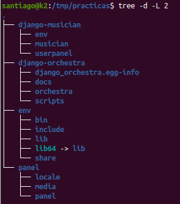

## Prepare your development environment
```bash
# on a Debian based environment:
apt=(
    git
    python3-pip
    python3-setuptools
)
sudo apt-get install --no-install-recommends -y ${apt[@]}
```

## Prepare back-end environment (django-orchestra)

https://github.com/ribaguifi/django-orchestra/

1. Clone & install django-orchestra

```bash
mkdir practicas && cd practicas

git clone https://github.com/ribaguifi/django-orchestra django-orchestra

python3 -m venv env
source env/bin/activate
pip install wheel
pip install -r django-orchestra/requirements.txt
pip install -e django-orchestra
```

2. Create project

```bash
orchestra-admin startproject panel
```

3. Prepare DB
```bash
cd panel
python manage.py migrate
# You will be prompted to create superuser
```

4. Run devel server & access web admin interface
```bash
# on practicas/panel folder
python manage.py runserver 9999
```

5. Open browser and go to admin interface: <http://127.0.0.1:9999/admin>

NOTE: keep development server running because it's needed by front-end (django-musician)

## Prepare front-end environment (django-musician)
https://github.com/ribaguifi/django-musician/

Open a new terminal and run the next steps.

1. Clone & install
```bash
# go to practicas base folder
cd practicas

git clone https://github.com/ribaguifi/django-musician.git django-musician
cd django-musician
python3 -m venv env
source env/bin/activate
pip install -r requirements.txt
```

2. Configure project (.env is used by [python-decouple](https://pypi.org/project/python-decouple/))
```bash
cp .env.example .env
# replace API_BASE_URL --> point to django-orchestra development server
sed -i 's/https:\/\/api.examplea.org/http:\/\/127.0.0.1:9999\/api/g' .env
echo "STATIC_ROOT=/tmp/" >> .env
```

4. Initialize project
```bash
# on practicas/django-musician folder
python manage.py migrate
```

5. Run devel server
```bash
# on practicas/django-musician folder
python manage.py runserver 8080
```

5. Open browser and login (use credentials created on django-orchestra installation): <http://127.0.0.1:8080/>

## Troubleshooting
Your folder tree should be something like that:


