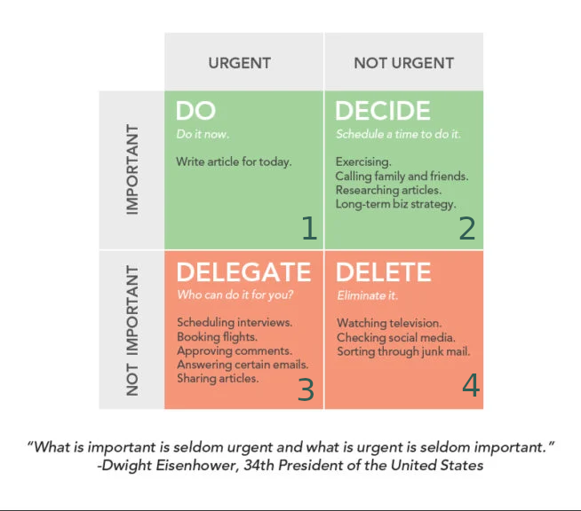

# Kaizen meetings

## #1. django-debug-toolbar
On **2020-10-30** by [Santiago](https://github.com/slamora)

A debugging tool apllied to optimize DB queries.

**Example:**

<https://github.com/ico-apps/monitoring/commit/9c467433f368e73a17ac33c902570378a5bb8ce2>

Before: ~18 sec to render , ~700 DB queries

After: ~2 sec to render, ~70 DB queries

**Links:**
  - <https://django-debug-toolbar.readthedocs.io/en/latest/>
  - <https://docs.djangoproject.com/en/3.1/ref/models/querysets/#select-related>

## #2. flutter
On **2020-11-16** by [Alejandro](https://github.com/AlejandroRG31)

Flutter is an open-source UI software development kit. It is used to develop applications for Android, iOS, Linux, Mac, Windows, Google Fuchsia, and the web from a single codebase.

Flutter is based in the idea that every frontend component is a Widget, this means that every screen, container, button... is treated as an object which has attributes, contain other widgets and can do/call actions

Flutter was made by google, and uses Dart as language and the main database used is Firebase both also made by google.

Article with some example code: https://jelenaaa.medium.com/flutter-and-dart-examples-for-total-beginners-part-1-49db182ee9a1

**Links:**
- https://flutter.dev/
- https://itsallwidgets.com/  (apps built with Flutter)
- https://gallery.flutter.dev/  (gallery/api of lots of widgets)
- https://dart.dev/
- https://firebase.google.com/

## #3. Selenium
On **2020-11-27** by [Mònica](https://github.com/dunetna)

Selenium is a portable framework for testing web applications. Selenium provides a playback tool for authoring functional tests without the need to learn a test scripting language (Selenium IDE).

**Components:**
 * Selenium IDE: Chrome/Firefox extensions that allow to record simple tests.
 * Selenium Webdriver: allows to write user web interface tests, accepts different language bindings (including Python).
 * Selenium Grid: allows to run tests on several machines.

**Example:** test generated by Selenium IDE, recording an user logging in and logging out. [selenium_example.py](kaizen-meetings/selenium_example.py)

**Links:**
- https://www.selenium.dev/
- https://www.selenium.dev/documentation/en/
- https://selenium-python.readthedocs.io/ (not official)

## #4. Nixpkgs
On **2020-12-11** by [Cayo](https://github.com/cayop)

[Nixpkgs](https://github.com/NixOS/nixpkgs) is the package manager of [Nixos](https://nixos.org/) this system is a reproducible, predictible and portable system.
We can use it to share an environment on our team regardless of the operating system of each person on the team.

**Links:**
- https://github.com/NixOS/nixpkgs
- https://nixos.org/manual/nix/stable/
- https://github.com/NixOS/nixpkgs/tree/master/doc/languages-frameworks
- https://mgdm.net/weblog/postgresql-in-a-nix-shell/

## #5. How to apply Eisenhower matrix to priorize tasks
On **2021-01-29** by [Santiago](https://github.com/slamora)

Urgent vs Important: *"What is important is seldom urgent and what is urgent is seldom important."*

Put the focus on the second quadrant

Effectivity (do the important) VS Productivity (do lots of things)

[4th generation agenda (fullsheet)](kaizen-meetings/agenda-4ta-generacion.ods)

**References:**
- **The 7 Habits of Highly Effective People**, *Stephen Covey*, 1989.
- https://blog.trello.com/eisenhower-matrix-productivity-tool-trello-board
- https://luxafor.com/the-eisenhower-matrix/
- https://woven.com/blog/the-eisenhower-matrix

## #6. Scrum and taiga.io
On **2021-01-14** by [Mònica](https://github.com/dunetna)

A brief intro to Scrum: roles, ceremonies and artifacts

Slides: [scrum-taiga.pdf](kaizen-meetings/scrum-taiga.pdf)

**References:**

https://www.agilevideos.com/
https://www.taiga.io/
* SCRUM 101 Scrum basics - https://www.youtube.com/watch?v=aQrsVfjbQZ4
* SCRUM 101 Scrum process - https://www.youtube.com/watch?v=29dnS7XGgqs
